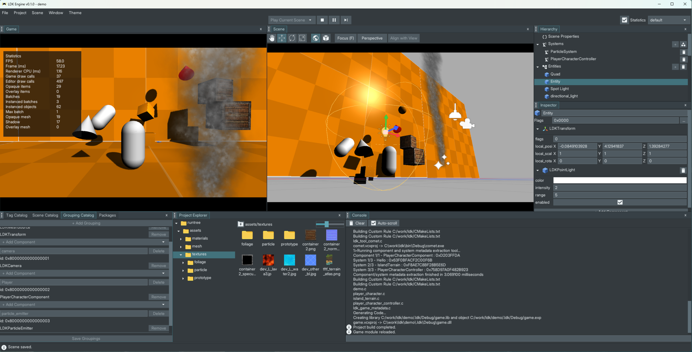

# LDK



LDK is a 3D game engine written in C, built from scratch on top of [STDX](https://handmadegame.dev/stdx/).

It is made for the games I want to build. It is not trying to be a universal engine, replace C with an object model, or hide the runtime behind an editor.

The main rule is simple: engine concepts should remain visible in the code. A scene is a scene. A component is data. A system is code that operates on a known set of entities. Assets have logical names. Filesystem details stay at the filesystem boundary.

LDK is still under active development. APIs can change when the current design proves to be wrong.

## Scenes, components and systems

LDK has a conventional ECS core with an unconventional scene/system model built around it.

Components are plain C data structures that can be attached to entities. They do not need an editor-side counterpart or a special base type.

**Groupings** describe sets of entities by the components they contain, and systems can be associated with those groupings. Scenes store which systems they use and, when needed, the state owned by those systems.

This makes system lifetime follow scene lifetime naturally. Replacing a scene can stop the old systems, destroy the old entities, load the new scene and start the systems selected by that scene. Systems do not need to become permanent global objects just because the engine has an ECS.

Systems also have explicit execution buckets such as pre-update, update, post-update and render, with deterministic ordering inside them.

### Code is the metadata source

LDK uses source annotations to expose those structures to tooling. A `//@component` annotation tells **Comet** to extract the component's type and field metadata, while `//@inspect` can describe how individual fields should appear in the editor.

```c
//@component
typedef struct LDKTransform
{
    Vec3 local_position;
    Vec3 local_scale;

    //@inspect widget=EULER
    Quat local_rotation;

    //@inspect hidden
    Mat4 world_matrix;
} LDKTransform;
```

Systems use `//@system` in the same way. Comet generates their metadata and descriptors directly from the C declarations.

```c
//@system name=ParticleSystem \
    initialize=ldk_particle_system_initialize \
    terminate=ldk_particle_system_terminate \
    flags=LDK_SYSTEM_FLAG_ENABLED|LDK_SYSTEM_FLAG_ENGINE_NATIVE \
    bucket=LDK_SYSTEM_BUCKET_POST_UPDATE
void ldk_particle_system_update(
    void *data, const LDKEntityGroup *group, float dt);
```

## The editor is not a second engine

The editor uses the same scene, ECS and asset structures as the game. It adds the tools needed to work with them: hierarchy and inspector views, transform gizmos, scene and system editing, project generation/building and package configuration.

Game code can be built as a shared module for use by the editor. A standalone launcher can build the same game code statically with a monolithic engine. This keeps the development and shipped versions close instead of maintaining a special "editor runtime" and a different "real runtime".

Projects are driven by CMake. LDK does not require a specific IDE project format; Visual Studio, Ninja and other CMake generators can be used as appropriate.

## Rendering

The renderer sits on top of a deliberately thin **Render Hardware Interface** (RHI). The RHI owns graphics resources and draw commands; it does not know about scenes, entities or engine systems.

The current backend is OpenGL 3.3. On top of it, LDK already has the engine-facing pieces needed for ordinary 3D work: meshes and materials, multiple views, instancing and batching, directional/point/spot lights, shadow rendering, debug drawing, particles and the editor/UI rendering path.

Keeping the renderer and RHI separate is useful even with a single backend today. The renderer can talk in terms of engine resources while backend-specific state remains contained below it.

That said, the renderer is fairly simple. Graphics programming is not my specialty.

## Asset packages

LDK has a package system for game assets. Code does not need to know whether an asset is stored as a loose file or inside a `.box` package.

For example, loading:

```text
textures/particles/smoke_01.png
```

always uses the same asset path.

If that asset exists inside one of the game's `.box` packages, LDK reads it from the package. If it does not, LDK looks for the same path in the game's asset folder.

The asset loader sees the same contents either way. Packaging does not change how the game refers to its assets.

## Project layout

A game project keeps source code and runtime content separate. A typical project is roughly:

```text
MyGame/
    game.ldk
    ldk_game.cmake
    src/
        game.c
        component/
        system/
    runtree/
        game.ini
        assets/
        scenes/
```

The `.ldk` file is the development-time project description. Public runtime configuration is exported to `runtree/game.ini`; editor/build-only sections stay in the project file.

Game-specific source inclusion remains explicit in `ldk_game.cmake`, while component and system directories are also passed to the metadata generator.

## Building

LDK currently has a Win32 platform layer and an OpenGL 3.3 RHI backend.

To build the editor:

```sh
cmake -S . -B build -DOPTION_BUILD_EDITOR=ON
cmake --build build --config Debug
```

Tests can be enabled with:

```sh
cmake -S . -B build-tests -DOPTION_BUILD_TESTS=ON
cmake --build build-tests --config Debug
```

Game projects are normally generated and built through LDK's project tooling, but they remain ordinary CMake projects underneath.

## Status

LDK is a working engine and editor, but it is also a design in progress. Some parts are intentionally simple, some are being replaced, and compatibility is less important than keeping the architecture understandable.

That is the point of the project: build the engine needed by the game, keep the layers small, and change a bad abstraction when it becomes visible instead of building more abstractions around it.
